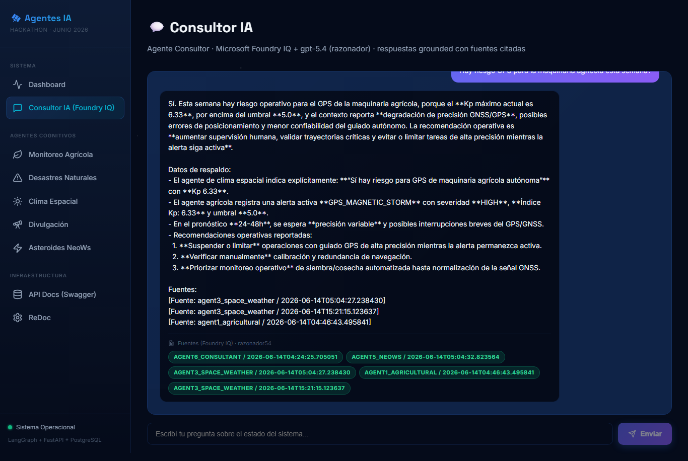

<div align="center">

#  SatellAI

### *When a solar storm threatens the harvest*

**The only multi-agent system that bridges space weather and agriculture.**
Six AI agents running on **Microsoft Azure AI Foundry** monitor real NASA data, **talk to each other**, and answer in natural language with **cited, grounded responses — zero hallucination — powered by Foundry IQ.**




</div>

---

##  The problem

Autonomous farm machinery across **Latin America depends on GPS**. A geomagnetic storm — triggered by the Sun 150 million km away — can **degrade that GPS and ruin a planting or a harvest**. Two worlds that nobody connects: space weather and the field.

##  What SatellAI does

Six cognitive agents monitor the Southern Cone with **real NASA data** and — crucially — **communicate with each other**:

>  When the **Space Weather agent** detects a geomagnetic storm (Kp above threshold), it **automatically alerts the Agricultural agent** about GPS precision loss in autonomous machinery. **Agents talking to agents, with no human in the loop.**

| Agent | What it does | Data source |
|-------|--------------|-------------|
|  **Agricultural** | Crop health via NDVI, anomalies vs history, water/thermal stress | **NASA MODIS**  real |
|  **Disasters** | Wildfires/floods cross-checked against farmland (PostGIS) | **NASA EONET**  real |
|  **Space Weather** | Geomagnetic storms → autonomous **GPS alerts** | **NASA DONKI**  real |
|  **Outreach** | APOD adapted to the audience + ISS passes | **NASA APOD**  real |
|  **Asteroids** | Hazardous NEOs, de-sensationalized | **NASA NeoWs**  real |
|  **Consultant** | **Natural-language Q&A grounded on every agent** | **gpt-5.4 + Foundry IQ** |

##  The star: the Foundry IQ Consultant

Ask anything in plain language. The **Consultant Agent** — a **gpt-5.4 reasoning model on Azure AI Foundry** — does three steps:

1. ** Retrieve** the relevant agent reports from **Foundry IQ** (Azure AI Search knowledge base)
2. ** Reason** over the retrieved context
3. ** Answer citing every source** — and **if it lacks data, it says so. Zero hallucination.**

And it's a **closed loop**: every report the agents generate is **auto-indexed into Foundry IQ**, so the Consultant always answers with the latest knowledge — no manual sync.

```
agents produce reports  →  Foundry IQ indexes them  →  Consultant answers, cited
```

##  Why it stands out

- ** Unique cross-domain angle** — space weather ↔ agriculture. Nothing else connects them.
- ** It actually runs** end-to-end, on **real NASA data**, **fully on Azure AI Foundry** — no external API keys.
- ** Trustworthy by design** — grounded, cited, anti-hallucination (our *Golden Rule*).
- ** Real impact** — anticipates water stress, disasters and GPS failures for Latin American farmers: **food security.**

##  Architecture — the *Golden Rule*

```
┌────────────────────────────────────────────────────────────┐
│  OUTPUT     Dashboard (React) · Chat Consultant · Slack/Email │
├────────────────────────────────────────────────────────────┤
│  REASONING  Azure AI Foundry · gpt-5.4 (Consultant) /         │
│             gpt-5.4-mini (5 agents) · LangGraph orchestration │
│  KNOWLEDGE  Foundry IQ  (Azure AI Search, cited retrieval)    │
├────────────────────────────────────────────────────────────┤
│  DATA       Supabase — PostgreSQL + PostGIS (local replica)  │
├────────────────────────────────────────────────────────────┤
│  INGEST     Scheduled / on-demand ETL → real NASA & MODIS    │
└────────────────────────────────────────────────────────────┘
```

> **Golden Rule:** agents **never** hit external APIs during a user query. They reason over a **local replica** (Supabase). The NASA/MODIS APIs are only called by the **ingestion layer** (scheduled or on-demand). Result: latency drops from ~5 s to **milliseconds**, and the system is **immune to NASA outages and rate limits**.

##  Honest about the data

| Source | Real? |
|--------|-------|
| Space weather — DONKI |  Real NASA API |
| Asteroids — NeoWs |  Real NASA API |
| Disasters — EONET |  Real NASA API |
| Astronomy — APOD |  Real NASA API |
| **Crop health — NDVI** |  **Real — NASA MODIS MOD13Q1 (ORNL DAAC), no auth** |
| ISS passes |  imulated (the Open Notify API was discontinued) |

##  Tech stack

**Azure AI Foundry** · **Foundry IQ** (Azure AI Search) · **gpt-5.4 / gpt-5.4-mini** reasoning models · **LangGraph** · **FastAPI** · **React + Vite** · **Supabase** (PostgreSQL/PostGIS) · Celery.

## Quick start

```bash
# 1) Configure credentials (Azure AI Foundry + Foundry IQ + Supabase) in .env
cp .env.example .env       # then fill AZURE_* and DATABASE_URL

# 2A) Docker (full stack: backend + worker + frontend + DB)
docker compose up --build

# 2B) Local (Supabase + uvicorn)
cd backend
./start_services.sh --reload          # installs deps, migrates, runs the API
cd ../frontend && npm install && npm run dev   # dashboard on :5173

# 3) Seed real data and ask the Consultant
curl -X POST http://localhost:8000/api/ingest/all
curl -X POST http://localhost:8000/api/agents/consult \
  -H "Content-Type: application/json" \
  -d '{"question": "Is there a GPS risk for farm machinery this week?"}'
```

- **Dashboard:** http://localhost:5173
- **API docs (Swagger):** http://localhost:8000/docs

##  Key endpoints

| Method | Endpoint | Description |
|--------|----------|-------------|
| POST | `/api/agents/consult` |  **Consultant** — grounded, cited answers (Foundry IQ) |
| POST | `/api/agents/run-all` | Run the full 5-agent pipeline |
| POST | `/api/agents/agricultural` | Agent 1 — NDVI monitoring (real MODIS) |
| POST | `/api/agents/space-weather` | Agent 3 — Kp + inter-agent GPS alert |
| POST | `/api/ingest/all` | Trigger ingestion from all NASA sources |

##  Team

Built for the **Microsoft Agents League Hackathon** by students at the
**Universidad Nacional de Córdoba (FCEFyN)**, **Universidad Tecnologica Nacional de Córdoba (UTN FRC)** and **Universidad Catolica de Córdoba (UCC)**.

<div align="center">

**SatellAI — where space weather meets the harvest.** 

</div>
